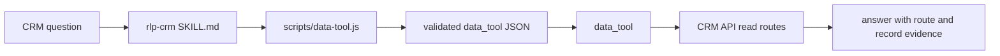

# Plan: RLP CRM Data Tool Script

## Story

Slug: `rlp-crm-data-tool-script`

Convert the CRM root workspace guidance into a script-backed `rlp-crm` skill and add a deterministic helper for read-only `data_tool` payloads.

## Architecture

## Tasks

- [x] Inspect relevant files
  - Confirm `crm-ai-workspace/AGENTS.md` route contract.
  - Confirm current `rlp-crm` skill shape.
  - Confirm project verification commands.
- [x] Make focused changes
  - Add `crm-ai-workspace/.agents/skills/rlp-crm/scripts/data-tool.js`.
  - Populate `crm-ai-workspace/.agents/skills/rlp-crm/SKILL.md`.
  - Ensure the script has a top comment block and no external side effects.
- [x] Run validation
  - Run representative script commands.
  - Run `npm run build`.
  - Run `npm test`.
- [x] Update docs/status
  - Mark completed plan tasks.
  - Run code review.
  - Run requirement verification.
  - Write done doc.

## E2E Decision

No separate E2E spec. This is a skill packaging and deterministic payload-generation change, not a user-facing browser flow or live CRM API integration. Validation should cover script behavior and repo build/tests without calling the CRM API.

## AR Review

AR passed: no blocking architecture flaws.

The helper should emit payloads, not call the API, because the host owns `data_tool` authorization and route enforcement. Keeping the script deterministic avoids leaking auth concerns into a workspace skill and gives agents a repeatable way to build only allowed read calls.
